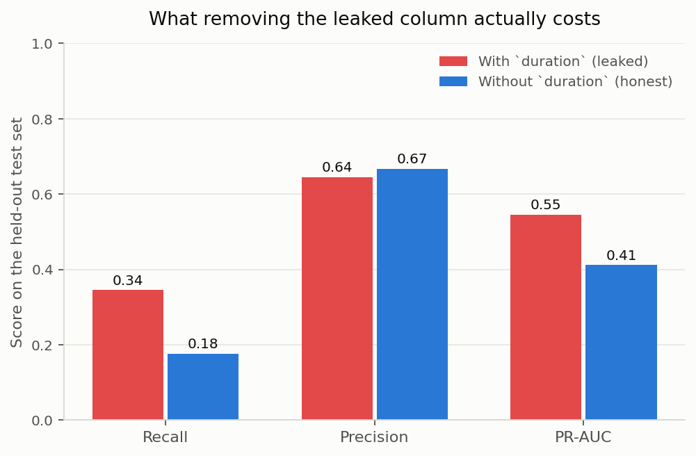
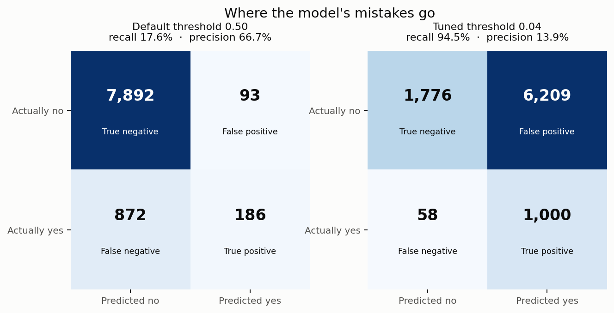
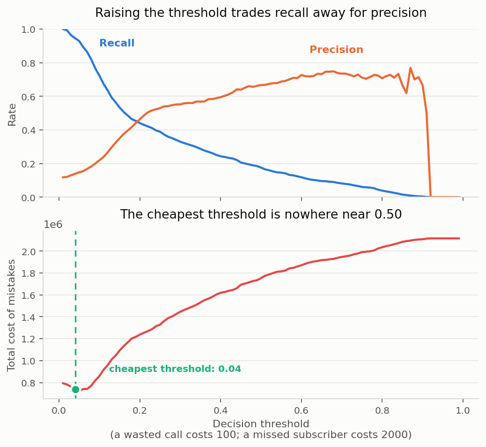
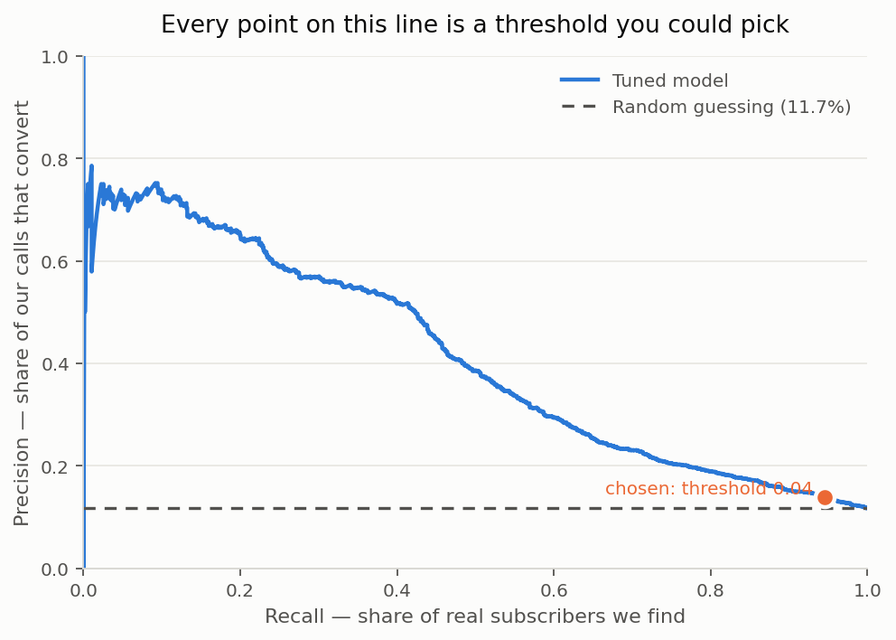

# Term Deposit Subscription Prediction

Predicting which bank customers will subscribe to a term deposit, using the
[UCI Bank Marketing dataset](https://archive.ics.uci.edu/dataset/222/bank+marketing)
(45,211 customers, 16 features).

**The point of this project is not accuracy. It is evaluation.** The model itself
is deliberately simple. The work is in measuring it honestly: choosing metrics
that survive a 9-to-1 class imbalance, finding and removing a leaked feature,
attaching a currency cost to each kind of mistake, and choosing the decision
threshold from that cost rather than accepting the 0.50 default.

---

## Headline results

All numbers are on a held-out test set that was split off before any model was
fitted and used exactly once.

| Model | Threshold | Accuracy | Precision | Recall | PR-AUC | Cost of mistakes |
|---|---|---|---|---|---|---|
| Baseline — always predicts "no" | — | **88.3%** | 0.0% | 0.0% | 0.117 | 2,116,000 |
| Logistic regression, default | 0.50 | 89.3% | 66.7% | 17.6% | 0.411 | 1,753,300 |
| Logistic regression, tuned | 0.04 | 30.7% | 13.9% | **94.5%** | 0.411 | 736,900 |
| Gradient boosting, tuned | 0.06 | 52.9% | 18.1% | 85.5% | **0.457** | **716,200** |

Read the first and last rows together. The baseline scores **88.3% accuracy while
finding zero subscribers**. The chosen model scores **52.9% accuracy** and is
worth roughly **1.4 million** more. Accuracy ranks these two backwards.

---

## 1. Why accuracy is the wrong metric here

11.7% of customers subscribed. Predicting "no" for all 45,211 of them is right
88.3% of the time and identifies nobody — so 88.3% accuracy is the score of a
model that does not exist. Any real model has to be compared against that floor,
which is why a `DummyClassifier` is the first thing this project trains.

The metrics that survive the imbalance:

- **Precision** — of the customers we call, what share actually subscribe. Low
  precision means wasted agent time.
- **Recall** — of the customers who would have subscribed, what share we find.
  Low recall means revenue left on the table.
- **PR-AUC** — precision and recall across every possible threshold, in one
  number. Its floor is the positive rate (0.117 here), not 0.5, which makes it
  honest about imbalance in a way ROC-AUC is not.

---

## 2. The data leakage

The dataset contains **`duration`**: how many seconds the sales call lasted.

On its own, with no model at all, `duration` scores **ROC-AUC 0.807** against the
target. One raw column carrying nearly the whole signal is the classic symptom of
leakage.

The reason is timing. You only know how long a call lasted *after* you have made
it — and by then you already know whether the customer said yes. A call that
lasted four seconds was a hang-up; a call that lasted nine minutes was a sale in
progress. `duration` does not predict the outcome, it *describes* it. It cannot
exist at the moment you are deciding whom to call, which is the only moment this
model would ever be used.

Removing it hurts, and that is the point:

| | Recall | Precision | PR-AUC |
|---|---|---|---|
| With `duration` | 34.5% | 64.5% | 0.545 |
| Without `duration` | 17.6% | 66.7% | 0.411 |



**A quarter of the model's apparent skill was information from the future.** Most
published results on this dataset keep `duration` in. Their numbers are not
comparable to these, and are not achievable in production.

---

## 3. What each mistake costs

A confusion matrix splits errors into two kinds that are not interchangeable:

- **False positive** — we call someone who was never going to subscribe. We lose
  the agent's time. Assumed cost: **100**.
- **False negative** — someone who would have subscribed is never called. We lose
  the profit on a deposit. Assumed cost: **2,000**.

These two numbers are assumptions, stated openly in `src/config.py` so a reader
can disagree with them. They encode the actual business judgement: **missing a
customer is 20x worse than wasting a call.**



At the default threshold the model misses 872 of the 1,058 subscribers in the
test set. At the tuned threshold it misses 58.

---

## 4. Tuning the decision threshold

A classifier does not output a decision; it outputs a probability. The threshold
is the line you draw to turn that probability into a yes or no. **0.50 is a
default, not a result** — and with a 20:1 cost asymmetry it is badly wrong.

Sweeping every threshold from 0.01 to 0.99 and pricing the resulting mistakes:



The cheapest threshold is **0.04**, not 0.50. It cuts the cost of mistakes by
**58%** — and it drives accuracy *down* from 89.3% to 30.7%. That single fact is
the clearest evidence in the project that accuracy was never measuring the thing
that mattered.

The threshold was chosen on a **separate validation split**, never on the test
set. Tuning on test would mean reporting a number that has already seen its own
exam paper.



---

## 5. Is the result real?

5-fold stratified cross-validation on the training data gives **PR-AUC 0.400
± 0.034**, against a test-set PR-AUC of **0.411**. The test result sits inside
the spread of the cross-validated one, so it is not an artefact of a lucky split.

---

## Honest limitations

- **The tuned threshold assumes unlimited calling capacity.** At 0.04 the model
  calls 7,209 of 9,043 customers. If a real call centre could only make 1,000
  calls a week, the right objective would be precision within the top 1,000
  scores, not total cost — a different question with a different answer.
- **The cost ratio is invented.** 100 and 2,000 are plausible, not measured. The
  chosen threshold moves if a real business supplies real numbers; the method
  does not.
- **`"unknown"` is kept as a category** in `job`, `education`, `contact` and
  `poutcome` rather than imputed. Whether the bank knows a customer's job is
  itself a signal, and imputing would invent data.
- **The data is from a Portuguese bank, 2008–2010.** It sits inside a financial
  crisis and would not transfer to another market or decade unexamined.

---

## Running it

Requires Python 3.10+.

```bash
git clone https://github.com/klu-2200031174/term-deposit-subscription-prediction.git
cd term-deposit-subscription-prediction

python -m venv .venv
source .venv/bin/activate        # Windows: .\.venv\Scripts\Activate.ps1
pip install -r requirements.txt

python src/download_data.py      # fetches the dataset from UCI (~4.5 MB)
python src/train.py              # runs the full analysis
python src/predict.py            # scores customers with the saved model
```

`train.py` prints the full report to the terminal and writes figures plus
`reports/results.md`.

---

## Project structure

```
src/config.py         paths, the cost model, the random seed — every tunable number
src/download_data.py  fetches the dataset from UCI so results are reproducible
src/data.py           loading, cleaning, and the train/validation/test split
src/evaluate.py       metrics, the cost function, and all four figures
src/train.py          the analysis end to end — run this
src/predict.py        loads the saved model and scores customers
notebooks/            exploratory work, kept as a record of how the data was read
reports/              generated figures and results.md
```

The dataset and the trained model are not committed — both are regenerated by the
scripts above.

## Stack

pandas · scikit-learn · matplotlib
